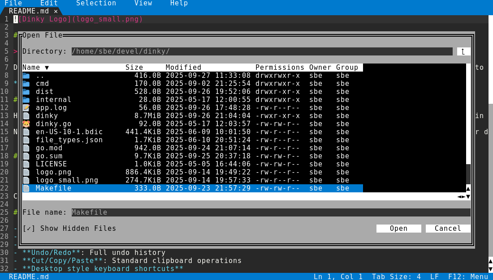

# Dinky

> A little text editor that just works

Dinky is a terminal-based text editor designed for people who want to quickly edit text without having to learn the arcane ways of vi, emacs, or other traditional terminal editors. It wraps the excellent editor component from [micro](https://github.com/zyedidia/micro) with a familiar GUI-style interface complete with menus, dialogs, and intuitive navigation.

**GitHub Repository:** https://github.com/sedwards2009/dinky

## Why Dinky?

Have you ever found yourself needing to quickly edit a file in the terminal but no wanting to waste brain cells learning another text editor "religion"? Then Dinky is for you! It provides a familiar interface with mouse support, menus, dialogs, scroll bars, and keyboard shortcuts. It all feels natural because you have been working like this on the desktop for years. It is like a desktop editor was squeezed down to fit inside your terminal.

Now you can edit that git commit or random config file in the terminal and then quickly get back to your desktop editor to do "real work". Dinky will even do a cheap cosplay impression of VSCode just to hammer on that sense of familiarity!


## Screenshots


Cutting edge graphical technology from 1985 is now available to you in the year 2025! Wow! 🤩



Yes! We can have nice things in a terminal application. 💎

## Features

- **Single executable**: Just one executable to download, runs from anywhere
- **Mouse support**: Including scroll wheel
- **Multiple tabs**: Work with multiple files simultaneously
- **File dialog**: You know, a normal file dialog
- **Multi-cursor editing**: Add cursors for simultaneous editing
- **Undo/Redo**: Full undo history
- **Cut/Copy/Paste**: Standard clipboard operations, also uses the desktop clipboard when available.
- **Desktop style keyboard shortcuts**: and menus which show the shortcuts so you can subconsciously learn them while you ~~sleep~~ work.
- **Go to Line**: Jump to specific lines & columns
- **Find**: Find that needle in the haystack
- **Find & Replace**: Replace said needle in haystack
- **Line numbers**: Toggle line number display
- **Bracket matching**: Navigate between matching brackets
- **Soft wrap**: Wrap long lines to window width
- **Show whitespace**: You need this for Makefiles, sorry
- **Syntax highlighting**: Support for multiple programming languages, looks pretty ✨
- **Vertical Ruler**: Keep those long lines under control
- **Sort & reverse lines**: Order those lines too
- **URL encode/decode, upper/lower case**


## Installation

Download a release binary from the [releases page](https://github.com/sedwards2009/dinky/releases).

or build from source:

```bash
git clone https://github.com/sedwards2009/dinky
cd dinky
go build dinky.go
```

## Usage

```bash
# Start with a new file
./dinky

# Open an existing file
./dinky filename.txt

# Open multiple files
./dinky file1.txt file2.txt
```

## Development Status

Very much in development, So much development. I'll try to do regular releases as things move along.

## Technical Details

Dinky is built in Go and uses:
- **[smidgen](https://github.com/sedwards2009/smidgen)**: The editor component (based on micro's editing engine)
- **[tview](https://github.com/rivo/tview/)**: Terminal UI framework
- **[tcell](https://github.com/gdamore/tcell)**: Cross-platform terminal handling

## License

Dinky is released under the [MIT License](LICENSE).

## Author

Created by **Simon Edwards** - [@sedwards2009](https://github.com/sedwards2009)

## Contributing

Contributions are welcome! Please feel free to submit issues, feature requests, or pull requests on the [GitHub repository](https://github.com/sedwards2009/dinky).

---

*Dinky: Because sometimes you just want to edit a file without having to join a cult.*
